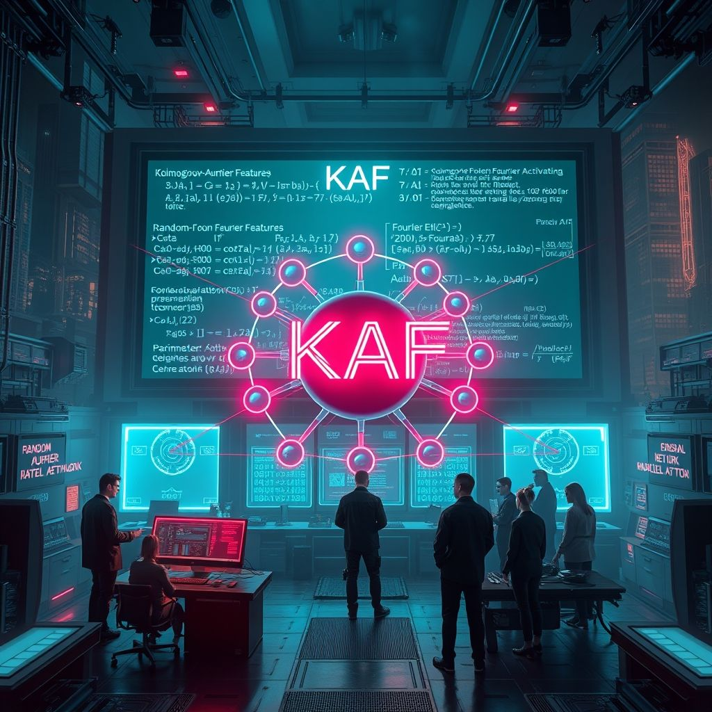
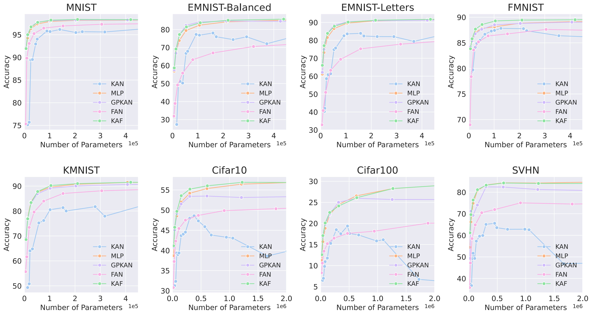

<div align="center">
  <table>
    <tr>
      <td><h1>Kolmogorov-Arnold Fourier Networks</h1></td>
    </tr>
  </table>
</div>

<p align="center">
<a href="https://arxiv.org/abs/2502.06018" alt="arXiv">
    </a>
      <a href="https://pytorch.org/"></a>
  <a href="https://opensource.org/licenses/MIT"></a>
</p>
<p align="center">

<p align="center">
 <br>
</p>

## 🤖 Introduction

This repository contains the implementation of the Kolmogorov-Arnold Fourier Networks (KAF) for solving different tasks , including vision, audio, NLP , function fitting and PDE solving.If you want to simply insert KAF into your project, see https://github.com/kolmogorovArnoldFourierNetwork/kaf_act.

## 📖 About KAF
Although Kolmogorov-Arnold based interpretable networks (KAN) havestrong theoretical expressiveness, they face significant parameter explosion and high-frequency feature capture challenges in high-dimensional tasks.
To address this issue, we propose the KolmogorovArnold-Fourier Network (KAF), which effectively integrates trainable Random Fourier Features and a novel hybrid GELUFourier activation mechanism to balance parameter efficiency and spectral representation capabilities. 

Based on [Kanbefair](https://github.com/yu-rp/KANbeFair), we test the performance of KAF on simple NLP, audio, CV and ML tasks .We also tested the performance of KAF on ViT, GPT2, PDE solving, function fitting and other tasks. The results show that KAF has good performance in most tasks.



## 🎯 Our Contributions

1.**Matrix merging**: Merge the two large matrices $W_A$ and $W_B$ of KAN to reduce the number of parameters of the traditional KAN network.

2.**Trainable RFF**: Replace the B-spline basis function with RFF, RFF can be more efficiently accelerated by GPU, and avoid spectral leakage through initialization strategy.

3.**Hybrid activation function**: Design a hybrid activation function containing GELU and RFF, and achieve a smooth transition from low frequency to high frequency by dynamically adjusting the learnable coefficients.

## 📚 Parameter comparison

| Model | Param Count (Single Layer) | FLOPs (Single Layer) |
|-------|---------------------------|---------------------|
| KAN | $d_{in}d_{out}(G + K + 3) + d_{out}$ | $7d_{in} + (d_{in}d_{out})[9K(G + 1.5K) + 2G - 2.5K + 3]$ |
| KAF | $d_{in}M + M + 2d_{in} + d_{in}d_{out} + d_{out}$ | $4d_{in}M + 2d_{in} + 2d_{in}d_{out} + 5d_{in}$ |
| MLP | $d_{in}d_{out} + d_{out}$ | $2d_{in}d_{out} + 5d_{out}$ |

## 🛠️ Installation

Simple plug-and-play modules see https://github.com/kolmogorovArnoldFourierNetwork/kaf_act.
```shell
pip install -r requirements.txt
```

For the organization and download of each dataset, please see the code. Most of them can be directly downloaded and organized using huggingface [datasets](https://huggingface.co/docs/datasets/en/index).

## 🙇 Acknowledgments
We thank the author of [Kanbefair](https://github.com/yu-rp/KANbeFair) for providing us with a benchmark. We thank the author of [KANtransformer](https://github.com/Adamdad/kat) and the contributors of [awesome-kan](https://github.com/mintisan/awesome-kan) for providing some inspiration. We thank the author of [KAN](https://github.com/KindXiaoming/pykan) for providing the basis for our work.

## 📚 Citation
If you find this work useful for your research, please consider citing our paper:

```
@misc{zhang2025kolmogorovarnoldfouriernetworks,
      title={Kolmogorov-Arnold Fourier Networks}, 
      author={Jusheng Zhang and Yijia Fan and Kaitong Cai and Keze Wang},
      year={2025},
      eprint={2502.06018},
      archivePrefix={arXiv},
      primaryClass={cs.LG},
      url={https://arxiv.org/abs/2502.06018}, 
}
```


